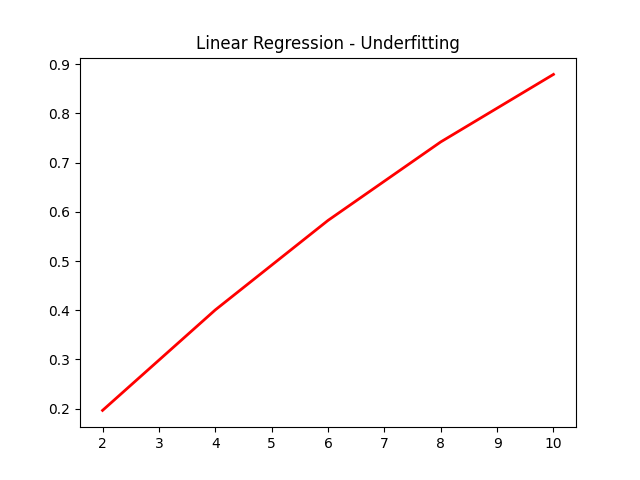

# 使用python对数据经行简单拟合分析

---

## 源代码

```python
import numpy as np
from matplotlib import pyplot as plt
from sklearn.preprocessing import PolynomialFeatures
from sklearn.pipeline import make_pipeline
from sklearn.metrics import mean_squared_error
from sklearn.linear_model import LinearRegression
x = [2,4,6,8,10]
x = np.array([2, 4, 6, 8, 10]).reshape(-1, 1)
# reshape(-1, 1):将一维数组转换为二维数组
y = [0.187000000,0.426666667,0.560333333,0.745666667,0.881333333]
degree = 2
polyreg = make_pipeline(PolynomialFeatures(degree), LinearRegression())
# 拟合数据
polyreg.fit(x, y)
# 绘制拟合曲线
plt.plot(x, polyreg.predict(x), color='red', linewidth=2)
plt.title('Linear Regression - Underfitting')
plt.show()
# 计算均方误差
mse = mean_squared_error(y, polyreg.predict(x))
print(f"Mean Squared Error: {mse}")
```

---

## 输出结果



```txt
    Mean Squared Error: 0.0002551288955377774
```
